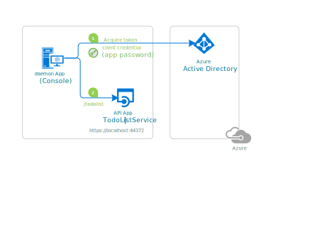

# A .NET Core daemon console application calling a Web API with its own identity

[](https://identitydivision.visualstudio.com/IDDP/_build/latest?definitionId=695)

## About this sample

### Overview

This sample application shows how to use the [Microsoft identity platform](http://aka.ms/aadv2) to access the data from a protected Web API, in a non-interactive process.  It uses the [OAuth 2 client credentials grant](https://docs.microsoft.com/en-us/azure/active-directory/develop/v2-oauth2-client-creds-grant-flow) to acquire an access token, which is then used to call the Web API. Additionally, it lays down all the steps developers need to take to secure their Web APIs with the [Microsoft identity platform](http://aka.ms/aadv2).

The app is a .NET Core console application that gets the list of "todos" from `TodoList-WebApi` project by using [Microsoft Authentication Library (MSAL) for .NET](https://aka.ms/aaddev) to acquire an access token for `TodoList-WebApi`.

## Scenario

The console application:

- acquires an access token from the Microsoft Identity Platform as an application (no user interaction required)
- and then calls `TodoList-WebApi` to get the a list of todo's, displaying the result



For more information on the concepts used in this sample, be sure to read the [Daemon application that calls web APIs documentation](https://docs.microsoft.com/en-us/azure/active-directory/develop/scenario-daemon-overview).

> ### Daemon applications can use two forms of secrets to authenticate themselves with Azure AD:
>
> - **application secrets** (also called application password).
> - **certificates**.
>
> The first approach (application secret) is discussed in the next paragraphs.
> A variation of this sample that uses a **certificate** instead, is available at the end of this article in [Variation: daemon application using client credentials with certificates](#Variation-daemon-application-using-client-credentials-with-certificates)

## How to run this sample

To run this sample, you'll need:

- [Visual Studio 2017](https://aka.ms/vsdownload) or just the [.NET Core SDK](https://www.microsoft.com/net/learn/get-started)
- An Internet connection
- A Windows machine (necessary if you want to run the app on Windows)
- An OS X machine (necessary if you want to run the app on Mac)
- A Linux machine (necessary if you want to run the app on Linux)
- An Azure Active Directory (Azure AD) tenant. For more information on how to get an Azure AD tenant, see [How to get an Azure AD tenant](https://azure.microsoft.com/en-us/documentation/articles/active-directory-howto-tenant/).

### Step 1:  Clone or download this repository

From your shell or command line:

```Shell
git clone https://github.com/Azure-Samples/active-directory-dotnetcore-daemon-v2.git
```

or download and exact the repository .zip file.

> Given that the name of the sample is pretty long, and so are the name of the referenced NuGet packages, you might want to clone it in a folder close to the root of your hard drive, to avoid file size limitations on Windows.

### Step 2:  Register the sample with your Azure Active Directory tenant

There is one project in this sample. To register it, you can:

- either follow the steps [Step 2: Register the sample with your Azure Active Directory tenant](#step-2-register-the-sample-with-your-azure-active-directory-tenant) and [Step 3:  Configure the sample to use your Azure AD tenant](#choose-the-azure-ad-tenant-where-you-want-to-create-your-applications)
- or use PowerShell scripts that:
  - **automatically** creates the Azure AD applications and related objects (passwords, permissions, dependencies) for you
  - modify the Visual Studio projects' configuration files.

If you want to use this automation:

1. On Windows run PowerShell and navigate to the root of the cloned directory
1. In PowerShell run:

   ```PowerShell
   Set-ExecutionPolicy -ExecutionPolicy RemoteSigned -Scope Process -Force
   ```

1. Run the script to create your Azure AD application and configure the code of the sample application accordingly.

   ```PowerShell
   .\AppCreationScripts\Configure.ps1
   ```

   > Other ways of running the scripts are described in [App Creation Scripts](./AppCreationScripts/AppCreationScripts.md)

1. Open the Visual Studio solution and click start

If you don't want to use this automation, follow the steps below

#### Choose the Azure AD tenant where you want to create your applications

As a first step you'll need to:

1. Sign in to the [Azure portal](https://portal.azure.com) using either a work or school account or a personal Microsoft account.
1. If your account is present in more than one Azure AD tenant, select `Directory + Subscription` at the top right corner in the menu on top of the page, and switch your portal session to the desired Azure AD tenant.
1. In the left-hand navigation pane, select the **Azure Active Directory** service, and then select **App registrations (Preview)**.

#### Register the service app (TodoList-webapi-daemon-v2)

1. Navigate to the Microsoft identity platform for developers [App registrations](https://go.microsoft.com/fwlink/?linkid=2083908) page.
1. Select **New registration**.
1. When the **Register an application page** appears, enter your application's registration information:
   - In the **Name** section, enter a meaningful application name that will be displayed to users of the app, for example `TodoList-webapi-daemon-v2`.
   - Leave **Supported account types** on the default setting of **Accounts in this organizational directory only**.
1. Select **Register** to create the application.
1. On the app **Overview** page, find the **Application (client) ID** value and record it for later. You'll need it to configure the Visual Studio configuration file for this project.
1. Select the **Expose an API** section, and:
   - On **Application ID URI**, click on **Set**. Keep the suggested value, for example `api://<web api client id>`
   - Click **Save**
1. Select the **Manifest** section, and:
   - Edit the manifest by locating the `appRoles`.  The role definition is provided in the JSON code block below. Leave the `allowedMemberTypes` to **Application** only. Each role definition in this manifest must have a different valid **Guid** for the "id" property.
   - Save the manifest.

The content of `appRoles` should be the following (the `id` can be any unique **Guid**)

```JSon
{
  ...
    "appRoles": [
        {
            "allowedMemberTypes": [
                "Application"
            ],
            "description": "Daemon apps in this role can consume the web api.",
            "displayName": "DaemonAppRole",
            "id": "7489c77e-0f34-4fe9-bf84-0ce8b74a03c4",
            "isEnabled": true,
            "lang": null,
            "origin": "Application",
            "value": "DaemonAppRole"
        }
    ],
 ...
}
```

#### Register the client app (daemon-console)

1. Navigate to the Microsoft identity platform for developers [App registrations](https://go.microsoft.com/fwlink/?linkid=2083908) page.
1. Select **New registration**.
   - In the **Name** section, enter a meaningful application name that will be displayed to users of the app, for example `daemon-console-v2`.
   - In the **Supported account types** section, select **Accounts in this organizational directory only ({tenant name})**.
   - Select **Register** to create the application.
1. On the app **Overview** page, find the **Application (client) ID** value and record it for later. You'll need it to configure the Visual Studio configuration file for this project.
1. From the **Certificates & secrets** page, in the **Client secrets** section, choose **New client secret**:

   - Type a key description (of instance `app secret`),
   - Select a key duration of either **In 1 year**, **In 2 years**, or **Never Expires**.
   - When you press the **Add** button, the key value will be displayed, copy, and save the value in a safe location.
   - You'll need this key later to configure the project in Visual Studio. This key value will not be displayed again, nor retrievable by any other means,
     so record it as soon as it is visible from the Azure portal.
1. In the list of pages for the app, select **API permissions**
   - Click the **Add a permission** button and then,
   - Ensure that the **My APIs** tab is selected
   - Select the API created in the previous step, for example `TodoList-webapi-daemon-v2`
   - In the **Application permissions** section, ensure that the right permissions are checked: **DaemonAppRole**
   - Select the **Add permissions** button
1. At this stage permissions are assigned correctly but the client app does not allow interaction. 
   Therefore no consent can be presented via a UI and accepted to use the service app. 
   Click the **Grant/revoke admin consent for {tenant}** button, and then select **Yes** when you are asked if you want to grant consent for the
   requested permissions for all account in the tenant.
   You need to be an Azure AD tenant admin to do this.

### Step 3:  Configure the sample to use your Azure AD tenant

In the steps below, "ClientID" is the same as "Application ID" or "AppId".

Open the solution in Visual Studio to configure the projects

#### Configure the service project

> Note: if you used the setup scripts, the changes below will have been applied for you

1. Open the `TodoList-WebApi\appsettings.json` file
1. Find the app key `Domain` and replace the existing value with your Azure AD tenant name.
1. Find the app key `TenantId` and replace the existing value with your Azure AD tenant ID.
1. Find the app key `ClientId` and replace the existing value with the application ID (clientId) of the `TodoList-webapi-daemon-v2` application copied from the Azure portal.

#### Configure the client project

> Note: if you used the setup scripts, the changes below will have been applied for you, with the exception of the national cloud specific steps.

1. Open the `Daemon-Console\appsettings.json` file
1. If you are connecting to a national cloud, change the instance to the correct Azure AD endpoint. [See this reference for a list of Azure AD endpoints.](https://docs.microsoft.com/graph/deployments#app-registration-and-token-service-root-endpoints)
1. Find the app key `Tenant` and replace the existing value with your Azure AD tenant name.
1. Find the app key `ClientId` and replace the existing value with the application ID (clientId) of the `daemon-console-v2` application copied from the Azure portal.
1. Find the app key `ClientSecret` and replace the existing value with the key you saved during the creation of the `daemon-console-v2` app, in the Azure portal.
1. Find the app key `TodoListBaseAddress` and set to `https://localhost:44372`
1. Find the app key `TodoListScope` and replace the existing value with the **App ID URI** of your web API, followed by "/.default".
   - If your tenant went through [domain verification](https://docs.microsoft.com/azure/active-directory/develop/howto-configure-publisher-domain) this can be `https://domain/.default`, for instance the scope would be `https://<tenant name>.onmicrosoft.com/<web api client id>/.default` where the `<tenant name>` is the Azure AD tenant name (not the tenant Id) and the `<web api client id>` is the application id (clientId) of the web API created above.
   - If your tenant did not go through domain verification this would be `api://<web api client id>/.default`

### Step 4: Run the sample

Clean the solution, rebuild the solution, and run it.  You might want to go into the solution properties and set both projects as startup projects, with the service project starting first.

Start the application, it will display the users in the tenant.

> [Consider taking a moment to share your experience with us.](https://forms.office.com/Pages/ResponsePage.aspx?id=v4j5cvGGr0GRqy180BHbRy8G199fkJNDjJ9kJaxUJIhUNUJGSDU1UkxFMlRSWUxGVTlFVkpGT0tOTi4u)

## About the code

The relevant code for this sample is in the `Program.cs` file, in the `RunAsync()` method. The steps are:

1. Create the MSAL confidential client application.

    Important note: even if we are building a console application, it is a daemon, and therefore a confidential client application, as it does not
    access Web APIs on behalf of a user but as an application.

    ```CSharp
    IConfidentialClientApplication app;
    app = ConfidentialClientApplicationBuilder.Create(config.ClientId)
                                              .WithClientSecret(config.ClientSecret)
                                              .WithAuthority(new Uri(config.Authority))
                                              .Build();
    ```

2. Define the scopes.

   Specific to client credentials, you don't specify, in the code, the individual scopes you want to access. You have statically declared
   them during the application registration step. Therefore the only possible scope is "resource/.default" (e.g. "api://922d4e30-640a-4c02-939a-59d241740b1c/.default")
   which means "the static permissions defined in the application"

    ```CSharp
    // With client credentials flows the scopes is ALWAYS of the shape "resource/.default", as the 
    // application permissions need to be set statically (in the portal or by PowerShell), and then granted by
    // a tenant administrator
    string[] scopes = new string[] { "api://922d4e30-640a-4c02-939a-59d241740b1c/.default" };
    ```

3. Acquire the token

    ```CSharp
    AuthenticationResult result = null;
    try
    {
        result = await app.AcquireTokenForClient(scopes)
                          .ExecuteAsync();
    }
    catch(MsalServiceException ex)
    {
        // AADSTS70011
        // Invalid scope. The scope has to be of the form "https://resourceurl/.default"
        // Mitigation: this is a dev issue. Change the scope to be as expected
    }
    ```

4. Call the API

    In this sample, we are calling "https://localhost:44372/api/todolist" with the access token as a bearer token.

    ```CSharp
    var defaultRequestHeaders = HttpClient.DefaultRequestHeaders;

    if (defaultRequestHeaders.Accept == null || !defaultRequestHeaders.Accept.Any(m => m.MediaType == "application/json"))
    {
        HttpClient.DefaultRequestHeaders.Accept.Add(new MediaTypeWithQualityHeaderValue("application/json"));
    }

    defaultRequestHeaders.Authorization = new AuthenticationHeaderValue("bearer", accessToken);
    ```

### TodoList Web API Code

The relevant code for the Web API is in the `Startup.cs` class. We are using the method `AddMicrosoftWebApi` to configure the Web API to authenticate using bearer tokens, validate them and protect the API from non authorized calls. These are the steps:

1. Configuring the API to authenticate using bearer tokens

    ```CSharp
    services.AddAuthentication(JwtBearerDefaults.AuthenticationScheme)
            .AddMicrosoftIdentityWebApi(Configuration);
    ```

2. Validating the tokens

    As a result of the above `AddMicrosoftWebApi` method, some audience and issuer validation is set up. More information can be found in [Microsoft Identity Web](https://github.com/AzureAD/microsoft-identity-web) project.

    ```CSharp
    if (options.TokenValidationParameters.AudienceValidator == null
     && options.TokenValidationParameters.ValidAudience == null
     && options.TokenValidationParameters.ValidAudiences == null)
    {
        RegisterValidAudience registerAudience = new RegisterValidAudience();
        registerAudience.RegisterAudienceValidation(
            options.TokenValidationParameters,
            microsoftIdentityOptions.Value);
    }

    // If the developer registered an IssuerValidator, do not overwrite it
    if (options.TokenValidationParameters.IssuerValidator == null)
    {
        // Instead of using the default validation (validating against a single tenant, as we do in line of business apps),
        // we inject our own multi-tenant validation logic (which even accepts both v1.0 and v2.0 tokens)
        options.TokenValidationParameters.IssuerValidator = AadIssuerValidator.GetIssuerValidator(options.Authority).Validate;
    }
    ```

3. Protecting the Web API

    Only apps that have added the **application role** created on **Azure Portal** for the `TodoList-webapi-daemon-v2`, will contain the claim `roles` on their tokens. This is also taken care by [Microsoft Identity Web](https://github.com/AzureAD/microsoft-identity-web)

    ```CSharp
    var tokenValidatedHandler = options.Events.OnTokenValidated;
    options.Events.OnTokenValidated = async context =>
    {
        // This check is required to ensure that the Web API only accepts tokens from tenants where it has been consented and provisioned.
        if (!context.Principal.Claims.Any(x => x.Type == ClaimConstants.Scope)
        && !context.Principal.Claims.Any(y => y.Type == ClaimConstants.Scp)
        && !context.Principal.Claims.Any(y => y.Type == ClaimConstants.Roles)
        && !context.Principal.Claims.Any(y => y.Type == ClaimConstants.Role))
        {
            throw new UnauthorizedAccessException("Neither scope or roles claim were found in the bearer token.");
        }

        await tokenValidatedHandler(context).ConfigureAwait(false);
    };
    ```

    The protection can also be done on the `Controller` level, using the `Authorize` attribute and `Policy`. Read more about [policy based authorization](https://docs.microsoft.com/en-us/aspnet/core/security/authorization/policies?view=aspnetcore-3.1):

    ```csharp
    [HttpGet]
    [Authorize(Policy = "DaemonAppRole")]
    public IActionResult Get()
    {
        ...
    }
    ```

## Troubleshooting

### Did you forget to provide admin consent? This is needed for daemon apps

If you get an error when calling the API `Insufficient privileges to complete the operation.`, this is because the tenant administrator has not granted permissions
to the application. See step 6 of [Register the client app (daemon-console-v2)](#register-the-client-app-daemon-console) above.

You will typically see, on the output window, something like the following:

```Json
Failed to call the Web Api: Forbidden
Content: {
  "error": {
    "code": "Authorization_RequestDenied",
    "message": "Insufficient privileges to complete the operation.",
    "innerError": {
      "request-id": "<a guid>",
      "date": "<date>"
    }
  }
}
```

## Variation: daemon application using client credentials with certificates

Daemon applications can use two forms of secrets to authenticate themselves with Azure AD:

- **application secrets** (also named application password). This is what we've seen so far.
- **certificates**. This is the object of this paragraph.


To [use client credentials protocol flow with certificates](https://docs.microsoft.com/en-us/azure/active-directory/develop/v2-oauth2-client-creds-grant-flow#second-case-access-token-request-with-a-certificate) instead of an application secret, you will need to do little changes to what you have done so far:

- (optionally) generate a certificate and export it, if you don't have one already
- register the certificate with your application in the application registration portal
- enable the sample code to use certificates instead of app secret.

### (Optional) use the automation script

If you want to use the automation script:
1. On Windows run PowerShell and navigate to the root of the cloned directory
1. In PowerShell run:

   ```PowerShell
   Set-ExecutionPolicy -ExecutionPolicy RemoteSigned -Scope Process -Force
   ```

1. Run the script to create your Azure AD application and configure the code of the sample application accordingly.

   ```PowerShell
   .\AppCreationScripts-WtihCert\Configure.ps1
   ```

   > Other ways of running the scripts are described in [App Creation Scripts](./AppCreationScripts-WithCert/AppCreationScripts.md)

If you don't want to use this automation, follow the following steps:

### (Optional) Create a self-signed certificate

To complete this step, you will use the `New-SelfSignedCertificate` Powershell command. You can find more information about the New-SelfSignedCertificate command [here](https://docs.microsoft.com/en-us/powershell/module/pkiclient/new-selfsignedcertificate).

1. Open PowerShell and run `New-SelfSignedCertificate` with the following parameters to create a self-signed certificate in the user certificate store on your computer:

    ```PowerShell
    $cert=New-SelfSignedCertificate -Subject "CN=DaemonConsoleCert" -CertStoreLocation "Cert:\CurrentUser\My"  -KeyExportPolicy Exportable -KeySpec Signature
    ```

1. Export this certificate using the "Manage User Certificate" MMC snap-in accessible from the Windows Control Panel. You can also add other options to generate the certificate in a different
store such as the Computer or service store (See [How to: View Certificates with the MMC Snap-in](https://docs.microsoft.com/en-us/dotnet/framework/wcf/feature-details/how-to-view-certificates-with-the-mmc-snap-in)).

Alternatively you can use an existing certificate if you have one (just be sure to record its name for the next steps)

### Add the certificate for the daemon-console-v2 application in Azure AD

In the application registration blade for your application, in the **Certificates & secrets** page, in the **Certificates** section:

1. Click on **Upload certificate** and, in click the browse button on the right to select the certificate you just exported (or your existing certificate)
1. Click **Add**

### Configure the Visual Studio project

To change the visual studio project to enable certificates you need to:

1. Open the `Daemon-Console\appsettings.json` file
1. Find the app key `CertificateName` and replace the existing value with the name of your certificate (if you generated your own certificate from the instructions above, this should be `CN=DaemonConsoleCert`).
1. If you had set `ClientSecret` previously, set its value to empty string, `""`.

#### Build and run

Build and run your project. You have the same output, but this time, your application is authenticated with Azure AD with the certificate instead of the application secret.

#### About the alternate code

The code change is the following: the `ClientCredentials` instance passed to the constructor of the `ConfidentialClientApplication` is now built from a `ClientAssertionCertificate` instance (built from the certificate) instead of from the application password

```CSharp
X509Certificate2 certificate = ReadCertificate(config.CertificateName);
app = ConfidentialClientApplicationBuilder.Create(config.ClientId)
                .WithCertificate(certificate)
                .WithAuthority(new Uri(config.Authority))
                .Build();
```

The rest of the application is the same. The sample also has a method to retrieve the certificate from the Windows certificate store (This part was not tested on Linux)

## Next Steps

Learn how to:

- [Integrate a daemon app with Key Vault and MSI](https://github.com/Azure-Samples/active-directory-dotnetcore-daemon-v2/tree/master/3-Using-KeyVault)

## Community Help and Support

Use [Stack Overflow](http://stackoverflow.com/questions/tagged/msal) to get support from the community.
Ask your questions on Stack Overflow first and browse existing issues to see if someone has asked your question before.
Make sure that your questions or comments are tagged with [`msal` `dotnet`].

If you find a bug in the sample, please raise the issue on [GitHub Issues](../../issues).

If you find a bug in Msal.Net, please raise the issue on [MSAL.NET GitHub Issues](https://github.com/AzureAD/microsoft-authentication-library-for-dotnet/issues).

To provide a recommendation, visit the following [User Voice page](https://feedback.azure.com/forums/169401-azure-active-directory).

## Contributing

If you'd like to contribute to this sample, see [CONTRIBUTING.MD](/CONTRIBUTING.md).

This project has adopted the [Microsoft Open Source Code of Conduct](https://opensource.microsoft.com/codeofconduct/). For more information, see the [Code of Conduct FAQ](https://opensource.microsoft.com/codeofconduct/faq/) or contact [opencode@microsoft.com](mailto:opencode@microsoft.com) with any additional questions or comments.

## More information

For more information, see MSAL.NET's conceptual documentation:

- [Quickstart: Register an application with the Microsoft identity platform](https://docs.microsoft.com/azure/active-directory/develop/quickstart-register-app)
- [Quickstart: Configure a client application to access web APIs](https://docs.microsoft.com/azure/active-directory/develop/quickstart-configure-app-access-web-apis)
- [Acquiring a token for an application with client credential flows](https://aka.ms/msal-net-client-credentials)

For more information about the underlying protocol:

- [Microsoft identity platform and the OAuth 2.0 client credentials flow](https://docs.microsoft.com/en-us/azure/active-directory/develop/v2-oauth2-client-creds-grant-flow)

For a more complex multi-tenant Web app daemon application, see [active-directory-dotnet-daemon-v2](https://github.com/Azure-Samples/active-directory-dotnet-daemon-v2)
