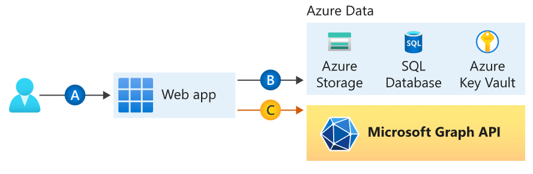
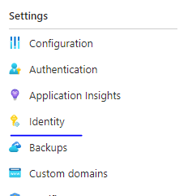
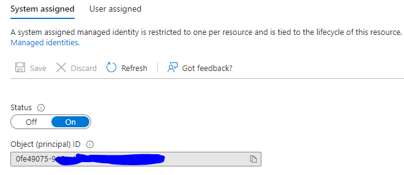
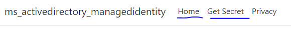

# Acquire a secret from an Azure Key Vault using the Microsoft identity platform

## About this sample

### Overview

This sample showcases how to acquire a secret from an Azure Key Vault using the Microsoft identity platform. It shows you how to use the [managed identity for app service](https://learn.microsoft.com/en-us/azure/app-service/overview-managed-identity) and acquire a token for an Azure Key Vault resource. 

The sample shows how to use [MSAL.NET (Microsoft Authentication Library)](https://github.com/AzureAD/microsoft-authentication-library-for-dotnet) to obtain an access token for [Azure Key Vault](https://vault.azure.net). Specifically, the sample shows how to retrieve the secret value from a key vault.

Finally, the sample also demonstrates how to use the different [types of managed identities](https://learn.microsoft.com/en-us/azure/active-directory/managed-identities-azure-resources/overview#managed-identity-types) to get an access token.

For more information about how the protocols work in this scenario and other scenarios, see [Authentication Scenarios for Azure AD](http://go.microsoft.com/fwlink/?LinkId=394414).

For more information about Managed Identity, please visit the [Managed Identities for Azure Resources homepage](https://learn.microsoft.com/en-us/azure/active-directory/managed-identities-azure-resources/overview).

## Topology



### Scenario

You want to access an Azure Key Vault secret from a web app. And, you don't want to worry about managing secrets or app credentials.

## How To Run This Sample

To run this sample, you'll need:

- [Visual Studio](https://aka.ms/vsdownload)
- An Internet connection
- An Azure Account to create, deploy, and manage applications. If you do not have an Azure Account, follow the [instructions](https://azure.microsoft.com/en-us/free/) to get a free account.

### Step 1:  Clone or download this repository

From your shell or command line:

```Shell
git clone https://repo link needs to be addedd here 
```

or download and extract the repository .zip file.

> Given that the name of the sample is long, and so are the names of the referenced NuGet packages, you might want to clone it in a folder close to the root of your hard drive, to avoid file size limitations on Windows.

### Step 2:  Modify the Key Vault URI and Secret name values in the code 

Following are the changes you need to make :

- In the [HomeController.cs]() file under the GetSecret method modify the following values, 

    ```cs
        var kvUri = "https://<your-key-vault-name>.vault.azure.net/";
    ```

- also, in the same file in the next line. Provide the secret name you want to query for.

    ```cs
        var secretName = "<secret name>";
    ```
### Step 3:  Build and Publish the sample

Clean the solution, rebuild the solution.

## Publish your web app

To publish your web app, you must first create and configure a new App Service that you can publish your app to.

As part of setting up the App Service, you'll create:

- A new [resource group](https://learn.microsoft.com/en-us/azure/azure-resource-manager/management/overview#terminology) to contain all of the Azure resources for the service.
- A new [Hosting Plan](https://learn.microsoft.com/en-us/azure/app-service/overview-hosting-plans) that specifies the location, size, and features of the web server farm that hosts your app.

Follow these steps to create your App Service resources and publish your project:

1. In **Solution Explorer**, right-click the **ms_activedirectory_managedidentity** project and select **Publish**.
1. In **Publish**, select **Azure** and then **Next**.

> Please refer to the ["Publish your web app"](https://learn.microsoft.com/en-us/azure/app-service/quickstart-dotnetcore?tabs=net60&pivots=development-environment-vs#publish-your-web-app) section for detailed instructions on how to publish this sample to an Azure Web App resource.

## After you deploy the sample to Azure 

There are few important settings you need to change for this sample to work :

### Enable managed identity on the app service

- After you publish the Web App to Azure, go to your resource in the [Azure Portal](https://portal.azure.com/)
- Select the `Identity` blade of the Web App
  
  
    
- Enable the System Assigned manaded identity of the resource.
  
  

> For detailed steps on how to turn on managed identity on an Azure Web app, please refer these [steps](https://learn.microsoft.com/en-us/azure/azure-app-configuration/howto-integrate-azure-managed-service-identity?tabs=core5x&pivots=framework-dotnet#add-a-managed-identity)

### Assign Azure roles using the Azure portal

Azure role-based access control (Azure RBAC) is the authorization system you use to manage access to Azure resources. To grant access, you assign roles to users, groups, service principals, or managed identities at a particular scope. This [article](https://learn.microsoft.com/en-us/azure/role-based-access-control/role-assignments-portal) describes how to assign roles using the Azure portal.

You will need to authorize the managed identity resource to access the key vault. 


## Launch the published web app

Once you launch the web app in the browser, you will see two new menu commands : `Home` and `Get Secret`.



Click on **Get Secret**: the app will show the secret value from the key vault.

> The sample uses the system assigned identity of the web app and gets the secret value from the key vault. 
> If you want to add more client side functionallity by getting the key vault name dynammically, please refer to the [Model Binding in ASP.NET Core](https://learn.microsoft.com/en-us/aspnet/core/mvc/models/model-binding?view=aspnetcore-7.0)

> Did the sample not work for you as expected? Did you encounter issues trying this sample? Then please reach out to us using the [GitHub Issues](../issues) page.

## About the code

Here there's a quick guide to the most interesting authentication-related bits of the sample.

### Acquiring the managed identity token

MSAL.NET supports acquiring tokens through the managed identity capability when used with applications running inside Azure infrastructure. You can read more about MSAL .NET support for managed identities [here](https://learn.microsoft.com/en-us/entra/msal/dotnet/advanced/managed-identity)

```CSharp
//Get a managed identity token using Microsoft Identity Client
IManagedIdentityApplication mi = CreateManagedIdentityApplication(userAssignedId);
var result = await mi.AcquireTokenForManagedIdentity(resource).ExecuteAsync().ConfigureAwait(false);
var accessToken = result.AccessToken;

private static IManagedIdentityApplication CreateManagedIdentityApplication(string? userAssignedId)
{
    if (userAssignedId == null)
    {
        return ManagedIdentityApplicationBuilder.Create()
            .WithExperimentalFeatures()
            .WithCacheOptions(CacheOptions.EnableSharedCacheOptions)
            .Build();
    }
    else
    {
        return ManagedIdentityApplicationBuilder.Create(userAssignedId)
            .WithExperimentalFeatures()
            .WithCacheOptions(CacheOptions.EnableSharedCacheOptions)
            .Build();
    }
}
```

> The sample app also reads the `userassignedid` from the query string. You can pass the value of the `user assigned client id` or a `resource id` to the sample app's GetSecret endpoint (GetSecret?userassignedid=1)

Important things to notice:

- `ManagedIdentityApplicationBuilder.Create()` will invoke the System Assigned managed identity of the Azure resource.
- For an Azure resource that supports user assigned managed identity you will need to pass either the `clientid` or the `resource id` using `ManagedIdentityApplicationBuilder.Create(userAssignedId)`

### Using the access tokens in the app

The `Get Secret` action in the `HomeController` class demonstrates how to take advantage of Microsoft.Identity.Client for calling Microsoft Key Vault without having to worry about secrets or certificates.

Here is the relevant code:

```CSharp
//Get the access token using MSAL 
var accessToken = result.AccessToken;

//create an HttpClient using IHttpClientFactory
HttpClient httpClient = _httpClientFactory.CreateClient();

//Use the access token to read secrets from the key vault 
httpClient.DefaultRequestHeaders.Add("Authorization", $"Bearer {accessToken}");
var response = await httpClient.GetAsync($"{kvUri}/secrets/{secretName}?api-version=7.2");
var secretValue = await response.Content.ReadAsStringAsync();
```

- First, you need to acquire an access token 
- Once you have the access token, create an HTTP client to call the Key Vault APIs. In C#, you can create an instance of HttpClient class.
- Add the access token as an authorization header to the HTTP client. Set the Authorization header to Bearer followed by the access token.
- Once you have set up the authorization header, you can make calls to Key Vault APIs. You can use the GetAsync method of the HTTP client to call the API.

Now the web page will show the secret value of the key vault secret you queried for.

## Community Help and Support

Following are the most common errors you would see if any step was missed during setup:

### An attempt was made to access a socket in a way forbidden by its access permissions. (169.254.169.254:80)

This error indicates that the managed identity endpoint is not reachable. 

> Causes : Managed identity was not turned on for the Azure Resource

### {"error":{"code":"Forbidden","message":"The user, group or application 'appid=xyz;oid=xyz;iss=https://sts.windows.net/xyz/' does not have secrets get permission on key vault '<key vault name>;location=xyz'. For help resolving this issue, please see https://go.microsoft.com/fwlink/?linkid=2125287","innererror":{"code":"AccessDenied"}}}

This error indicates that the managed identity service principal was not granted access to the key vault. 

> Causes : Managed identity resource was not granted access to the Key Vault

## Community Help and Support

Use [Stack Overflow](http://stackoverflow.com/questions/tagged/msal) to get support from the community.
Ask your questions on Stack Overflow first and browse existing issues to see if someone has asked your question before.
Make sure that your questions or comments are tagged with [`msal` `dotnet` `microsoft-graph`].

If you find a bug in the sample, please raise the issue on [GitHub Issues](../../issues).

To provide a recommendation, visit the following [User Voice page](https://feedback.azure.com/forums/169401-azure-active-directory).

## Contributing

If you'd like to contribute to this sample, see [CONTRIBUTING.MD](/CONTRIBUTING.md).

This project has adopted the [Microsoft Open Source Code of Conduct](https://opensource.microsoft.com/codeofconduct/). For more information, see the [Code of Conduct FAQ](https://opensource.microsoft.com/codeofconduct/faq/) or contact [opencode@microsoft.com](mailto:opencode@microsoft.com) with any additional questions or comments.

## More information

For more information, visit the following links:

- [Add sign-in with Microsoft to an ASP.NET web app (V2 endpoint)](https://docs.microsoft.com/azure/active-directory/develop/guidedsetups/active-directory-aspnetwebapp) explains how to re-create the sign-in part of this sample from scratch.
- To learn more about the code, visit [Conceptual documentation for MSAL.NET](https://github.com/AzureAD/microsoft-authentication-library-for-dotnet/wiki#conceptual-documentation) and in particular:

  - [Acquiring tokens with authorization codes on web apps](https://github.com/AzureAD/microsoft-authentication-library-for-dotnet/wiki/Acquiring-tokens-with-authorization-codes-on-web-apps)
  - [Customizing Token cache serialization](https://github.com/AzureAD/microsoft-authentication-library-for-dotnet/wiki/token-cache-serialization)
  - [Acquiring a token on behalf of a user Service to Services calls](https://github.com/AzureAD/microsoft-authentication-library-for-dotnet/wiki/on-behalf-of) 

- Articles about the Azure AD V2 endpoint [http://aka.ms/aaddevv2](http://aka.ms/aaddevv2), with a focus on:

  - [Azure Active Directory v2.0 and OAuth 2.0 On-Behalf-Of flow](https://docs.microsoft.com/azure/active-directory/develop/active-directory-v2-protocols-oauth-on-behalf-of)
  - [Incremental and dynamic consent](https://docs.microsoft.com/azure/active-directory/develop/active-directory-v2-compare#incremental-and-dynamic-consent)

- Articles about the Microsoft Graph
  - [Overview of Microsoft Graph](https://developer.microsoft.com/graph/docs/concepts/overview)
  - [Get access tokens to call Microsoft Graph](https://developer.microsoft.com/graph/docs/concepts/auth_overview)
  - [Use the Microsoft Graph API](https://developer.microsoft.com/graph/docs/concepts/use_the_api)
