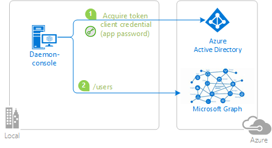

# Build daemon console application with the Azure AD v2.0 endpoint

[](https://identitydivision.visualstudio.com/IDDP/_build/latest?definitionId=695)

## About this sample

This sample application shows how to use the [Azure AD v2.0 endpoint](http://aka.ms/aadv2) to access the data of Microsoft business customers in a long-running, non-interactive process.  It uses the OAuth2 client credentials grant to acquire an access token, which can be used to call the [Microsoft Graph](https://graph.microsoft.io) and access organizational data

The app is a .NET Core 2.1 Console application. It gets the list of users in an Azure AD tenant by using `Microsoft Authentication Library (MSAL) Preview for .NET` to acquire a token.

## Scenario

The console application:

- gets a token from Azure AD in its own name (without a user)
- and then calls the Microsoft Graph /users endpoint to get the list of user, which it then displays (as JSon blobs)



For more information on the concepts used in this sample, be sure to read the [v2.0 endpoint client credentials protocol documentation](https://azure.microsoft.com/documentation/articles/active-directory-v2-protocols-oauth-client-creds).

> Looking for previous versions of this code sample? Check out the tags on the [releases](../../releases) GitHub page.

## How To Run this Sample

To run this sample, you'll need:

- [Visual Studio 2017](https://aka.ms/vsdownload)
- An Internet connection
- An Azure Active Directory (Azure AD) tenant. For more information on how to get an Azure AD tenant, see [How to get an Azure AD tenant](https://azure.microsoft.com/en-us/documentation/articles/active-directory-howto-tenant/)
- One or more user accounts in your Azure AD tenant. This sample will not work with a Microsoft account (formerly Windows Live account). Therefore, if you signed in to the Azure portal with a Microsoft account and have never created a user account in your directory before, you need to do that now.

### Register an app

Create a new app at [apps.dev.microsoft.com](https://apps.dev.microsoft.com), or follow these [detailed steps](https://docs.microsoft.com/azure/active-directory/develop/active-directory-v2-app-registration).  Make sure to:

- Use an identity that will be known by the tenant you intend to use with the application
- Copy down the **Application ID** assigned to your app, you'll need it soon.
- Generate an **Application Secret** of the type **Password**, and copy it for later.  In production apps, you should always use certificates as your application secrets, but this sample will only use a shared secret password.
- Add the **Web** platform for your app (even if it's a console application, it's a daemon app, and therefore a confidential client)

If you have an existing application that you've registered in the past, feel free to use that instead of creating a new registration.

### Configure your app for admin consent

Declare the application permissions your app will use ahead of time.  While still in the registration portal,

- Locate the **Microsoft Graph Permissions** section on your app registration.
- Under **Application Permissions**, add the `User.Read.All` permission.
- Be sure to **Save** your app registration.
- Make sure that the tenant admin grants this permission. Following the steps in the following article [Request the permissions from a directory admin](https://docs.microsoft.com/en-us/azure/active-directory/develop/v2-permissions-and-consent#request-the-permissions-from-a-directory-admin)

### Download & configure the sample code

You can download this repository as a .zip file using the button above, or run the following command:

`git clone https://github.com/Azure-Samples/active-directory-dotnetcore-daemon-v2.git`

Once you've downloaded the sample, open it using Visual Studio.  Open the `daemon-console\appsettings.json` file, and replace the following values:

- Replace the `ClientId` value with the application ID you copied above during App Registration.
- Replace the `Tenant` value with GUID representing the Tenant ID (which you get from the properties of the Azure Active Directory tenant), or with a domain name associated with the tenant.
- Replace the `ClientSecret` value with the application secret you copied above during App Registration.

### Run the sample

Start the application, it will display the users in the tenant.

## About the code

The relevant code for this sample is in the `Program.cs` file, in the `RunAsync()` method. The steps are:

1. Create the MSAL confidential client application.

    Important note: even if we are building a console application, it is a daemon, and therefore a confidential client application, as it does not
    access Web APIs on behalf of a user, but on its own application behalf.

    ```CSharp
    ClientCredential clientCredentials = new ClientCredential(config.ClientSecret);
    var app = new ConfidentialClientApplication(config.ClientId, config.Authority, 
                                                "https://daemon", clientCredentials, null, new TokenCache());

    ```

2. Define the scopes.

   Specific to client credentials, you don't specify, in the code, the individual scopes you want to access. You have statically declared
   them during the application registration step. Therefore the only possible scope is "resource/.default" (here "https://graph.microsoft.com/.default")
   which means "the static permissions defined in the application"

    ```CSharp
    // With client credentials flows the scopes is ALWAYS of the shape "resource/.default", as the 
    // application permissions need to be set statically (in the portal or by PowerShell), and then granted by
    // a tenant administrator
    string[] scopes = new string[] { "https://graph.microsoft.com/.default" };
    ```

3. Acquire the token

    ```CSharp
    AuthenticationResult result = null;
    try
    {
        result = await app.AcquireTokenForClientAsync(scopes);
    }
    catch(MsalServiceException ex) when (ex.Message.Contains("AADSTS70011"))
    {
        // Invalid scope. The scope has to be of the form "https://resourceurl/.default"
        // Mitigation: this is a dev issue. Change the scope to be as expected
    }
    ```

4. Call the API

    In that case calling "https://graph.microsoft.com/v1.0/users" with the access token as a bearer token.

## Troubleshooting

If you get an error when calling the API that the application identity could not be determined, this is because the tenant administrator has not granted permissions
to the application. See step [Configure your app for admin consent](#Configure your app for admin consent) above

## Community Help and Support

We use [Stack Overflow](http://stackoverflow.com/questions/tagged/msal) with the community to provide support. We highly recommend you ask your questions on Stack Overflow first and browse existing issues to see if someone has asked your question before. Make sure that your questions or comments are tagged with [msal.dotnet].

If you find and bug in the sample, please raise the issue on [GitHub Issues](../../issues).

If you find a bug in msal.Net, please raise the issue on [MSAL.NET GitHub Issues](https://github.com/AzureAD/microsoft-authentication-library-for-dotnet/issues).

To provide a recommendation, visit the following [User Voice page](https://feedback.azure.com/forums/169401-azure-active-directory).

## Contributing

If you'd like to contribute to this sample, see [CONTRIBUTING.MD](/CONTRIBUTING.md).

This project has adopted the [Microsoft Open Source Code of Conduct](https://opensource.microsoft.com/codeofconduct/). For more information, see the [Code of Conduct FAQ](https://opensource.microsoft.com/codeofconduct/faq/) or contact [opencode@microsoft.com](mailto:opencode@microsoft.com) with any additional questions or comments.

## More information

For more information, see MSAL.NET's conceptual documentation:

- [Acquiring a token for an application with client credential flows](https://aka.ms/msal-net-client-credentials)

For more information about the underlying protocol:

- [Azure Active Directory v2.0 and the OAuth 2.0 client credentials flow](https://docs.microsoft.com/en-us/azure/active-directory/develop/v2-oauth2-client-creds-grant-flow)

For a more complex multi-tenant Web app daemon application, see [active-directory-dotnet-daemon-v2](https://github.com/Azure-Samples/active-directory-dotnet-daemon-v2)
